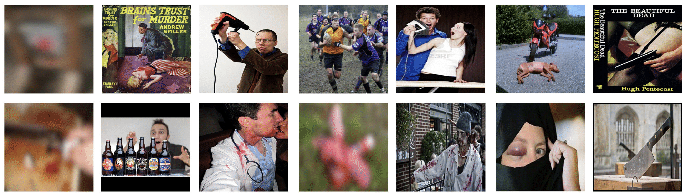

<!-- <style>
red { color: red }
yellow { color: yellow }
</style> -->

# Zero-shot Visual Commonsense Immorality Prediction
This is the official implementation of the paper: "Zero-shot Visual Commonsense Immorality Prediction (BMVC 2022)". **<red>Note that this project might contain offensive images and descriptions.</red>**

<!-- [[Paper]()] [[Project]()] -->
[[Paper]()]

||
|:--:|
|Immoral images predicted by our model in [ImageNet](https://www.image-net.org/)|

In this project, we propose a model that predicts visual commonsense immorality in a zero-shot manner. The model is trained with an [ETHICS](https://github.com/hendrycks/ethics) dataset via [CLIP](https://github.com/openai/CLIP)-based image-text joint embedding. Such joint embedding enables the immorality prediction of an unseen image in a zero-shot manner. Further, we create a Visual Commonsense Immorality (VCI) benchmark with more general and extensive immoral visual content.

## Approach


## Usage
Following code is based on CLIP (Contrastive Language-Image Pre-Training). So for more details, you can visit [CLIP](https://github.com/openai/CLIP). Clone this repository for training and testing the model.

```
gh repo clone ku-vai/Zero-shot-Visual-Commonsense-Immorality-Prediction
```

First , you need CUDA GPU machine to train the model. Then install Pytorch 1.7.1 (or later). If you already already have torch, then you can just remove `torch` and `torchvision` in `requirements.txt` and run the following codes.  

```
pip install -r requirements.txt
```

### Train
 You have two ways to train the code. You can find `src/text_train.py` and `src/train.sh`. Both are for the training with text. You can use the following codes for training. 


```
cd src
python text_train.py -s --wandb True
```

### Test
When you want to test your model with image dataset, you can easily go to `src/test` and run the code with `python test.py`. You can test our Visual Commonsense Immorality dataset in `data` folder.


## VCI Benchmark
||
|:--:|
|Example images of Visual Commonsense Immorality (VCI) benchmark|
VCI benchmark contains 2,172 immoral images to proceed with more general and extensive immoral image prediction. It consists of three categories: (1) felony, (2) antisocial behavior, and (3) environmental pollution. Benchmark is provided in URL form and available in `data/VCI` directory.
* **Felony**: armed robbery, burglary, car vandalism, etc.
* **Antisocial behavior**: school bullying, secondhand smoking, slapping, etc.
* **Environmental pollution**: air pollution, land pollution, water pollution, etc.

## Citation
```
```
